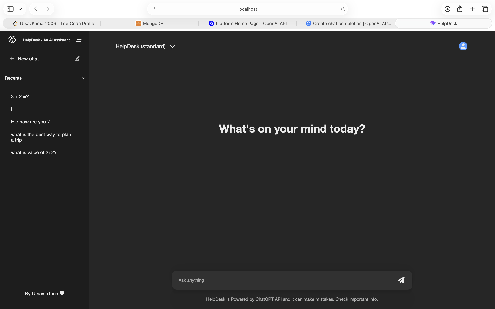
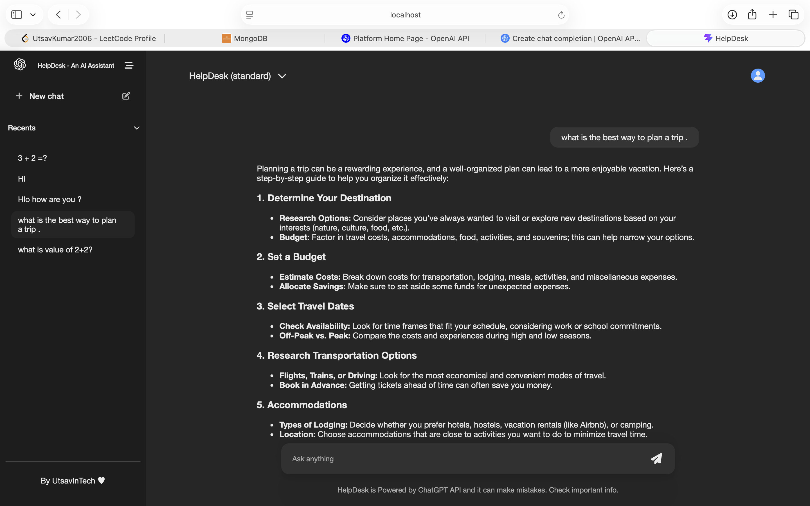
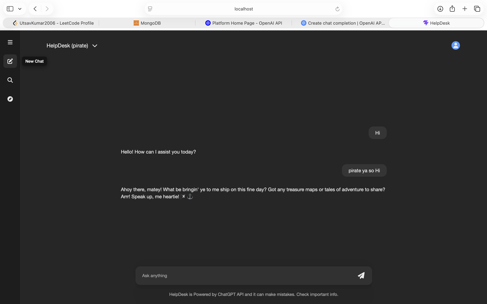
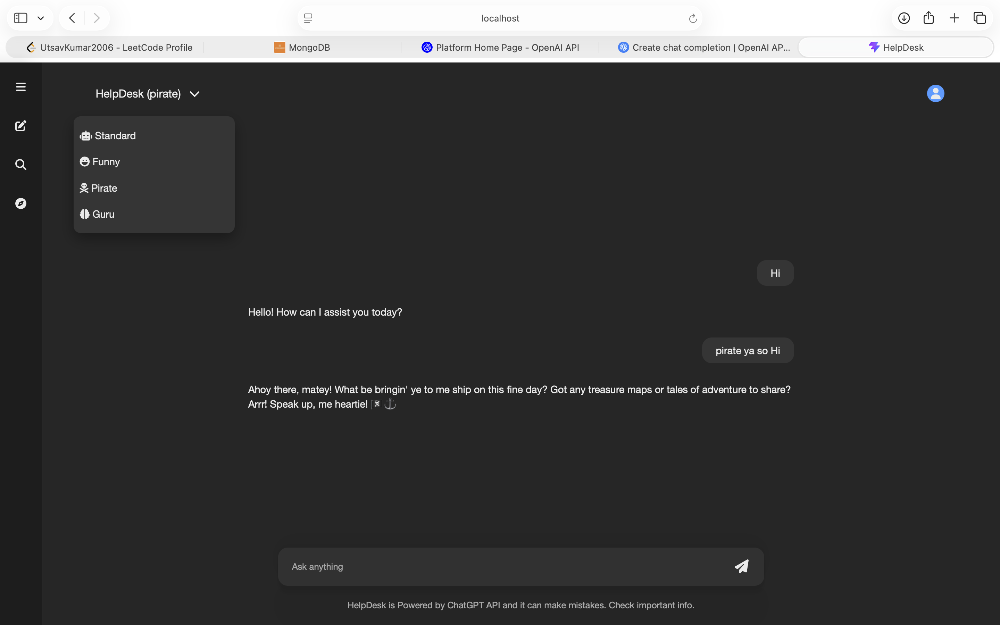
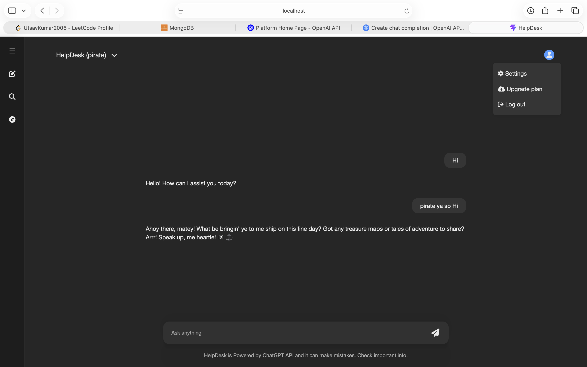

    
# HelpDesk AI
An AI-powered ChatGPT-inspired conversational assistant built with React, Node.js, MongoDB, and the OpenAI GPT-4o Mini API.

The application provides a modern chat experience with conversation history, multiple AI personalities, persistent chat threads, and a responsive user interface.

##  Features

-  AI-powered conversations using GPT-4o Mini
-  Multiple AI personalities
  - Standard Assistant
  - Funny
  - Pirate
  - Guru
-  Persistent conversation history
-  Automatic thread management
-  Recent chats sidebar
-  Responsive interface
-  Real-time responses
-  Modern ChatGPT-inspired UI
-  MongoDB database integration

##  Tech Stack

### Frontend
- JavaScript (ES6+)
- React
- Context API
- CSS3
- Vite
- Font Awesome
- React Spinners

### Backend

- Node.js
- Express.js
- MongoDB
- Mongoose
- OpenAI API

### AI

- OpenAI GPT-4o Mini API


##  Screenshots








## Project Structure

```
HelpDesk/
│
├── backend/
│   ├── routes/
│   ├── utils/
│   ├── server.js
│   └── .env.example
│
├── Frontend/
│   ├── src/
│   ├── public/
│   └── package.json
│
└── README.md
```

## ⚙ Installation

- Dependencies That needs to be installed if you dont clone from here 
- 1. Frontend - npm create vite@latest choose React, JavaScript , npm i uuid
- 2. Backend - npm i express nodemon cors, npm i mongoose, npm install openai, npm i dotenv
### Clone the repository

```bash
git clone https://github.com/UtsavInTech/HelpDesk-Ai-Assistant
```
### Backend
```bash
cd backend
npm install
```
Create a `.env` file
```env
OPENAI_API_KEY=your_api_key
```

Run backend
```bash
nodemon server.js
```

### Frontend

```bash
cd Frontend
npm install
npm run dev
```

##  Environment Variables

Create a `.env.example` file inside the backend directory.

```env
OPENAI_API_KEY=your_openai_api_key
```

##  Future Improvements
- User Authentication for private chat history
- User-specific conversation management
- Dark / Light Theme
- Chat Export (PDF / TXT)
- Multiple GPT Models
- Custom Personalities
- Voice Conversations
- Image Generation
- Markdown Rendering
- Code Syntax Highlighting Improvements
- Theme Switching
- File Upload Support
- Streaming Responses
- Export Chat History
- Multi-language Support

##  Author
**Utsav Kumar**

GitHub: https://github.com/UtsavInTech
LinkedIn: https://www.linkedin.com/in/utsav-tech/


## License

This project is developed for learning purposes.